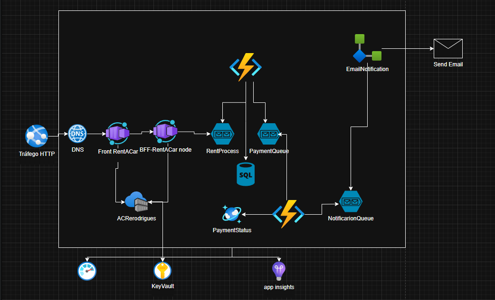

# Rent-a-Car Project

A microservices-based car rental system using Azure cloud services.

## Project Structure

```
rent-a-car-project/
├── functions/
│   ├── fnSBRentProcess/       # Azure Function to process rental requests
│   └── fnPayment/             # Azure Function to handle payments
├── Dockerfile                 # Container configuration for the API
├── index.js                  # Main API entry point
├── package.json              # Node.js dependencies
├── db.sql                    # Database schema
├── credencial.ps1            # PowerShell script for Azure credentials
└── .env                      # Environment variables
```

## Components

### 1. API Service (Node.js)
- Located in `index.js`
- Handles incoming rental requests
- Uses Express.js framework
- Communicates with Azure Service Bus

### 2. Rental Processing Function (fnSBRentProcess)
- Processes rental requests from Service Bus queue
- Stores rental information in SQL Database
- Forwards approved rentals to payment queue

### 3. Payment Function (fnPayment)
- Processes payment requests
- Stores payment information in Cosmos DB
- Sends notifications for approved payments
- Randomly assigns payment status (Approved/Declined/Pending)

## Azure Services Used

- Azure Container Apps - Hosting the API
- Azure Service Bus - Message queuing
- Azure Functions - Processing business logic
- Azure SQL Database - Storing rental information
- Azure Cosmos DB - Storing payment information
- Azure Container Registry - Docker image storage

## Environment Setup

1. Create `.env` file based on `.env-example`
2. Configure Azure credentials in `credencial.ps1`
3. Set up Azure SQL Database using `db.sql`

## Deployment

### API Deployment
```bash
# Build and push Docker image
docker build -t your-image-name .
docker push your-registry/your-image-name

# Deploy to Azure Container Apps
az containerapp create [options]
```

### Function Deployment
- Deploy both functions using Visual Studio or Azure CLI
- Configure application settings in Azure Portal

## Message Flow

1. Client → API: Rental Request
2. API → Service Bus: Rental Message
3. fnSBRentProcess → SQL Database: Store Rental
4. fnSBRentProcess → Payment Queue: Payment Request
5. fnPayment → Cosmos DB: Store Payment
6. fnPayment → Notification Queue: Payment Approval (if approved)

## Dependencies

- Node.js v18+
- .NET 8.0
- Azure CLI
- Docker


## Architecture

